**Author**: [@PiotrBerebecki](https://github.com/PiotrBerebecki)  
**Maintainer**: [@PiotrBerebecki](https://github.com/PiotrBerebecki)

# Git Workflow Workshop for Two Programmers 💻 💻


<!-- ***********************************************************-->
## Workshop summary

An exercise to practice git workflow skills. The workshop should be undertaken by two programmers, working on two computers. The skills practiced include:

- cloning a repository
- creating branches
- switching branches
- adding changes to staging area
- committing changes
- pulling latest version from the remote master branch
- merging master branch into recently created branch
- resolving merge conflicts
- pushing to remote repository
- creating a pull request on GitHub
- merging a pull request on GitHub


<!-- ***********************************************************-->
# Initial setup :rocket:

You're working in a team of two on a project for a new client. Steps 1 to 8 in this section should be completed by one of you, which we'll refer to as `Programmer 1`.

## Step 1 - Programmer 1 creates a new GitHub repo and clones it

1. Go to your cohort's GitHub organisation and create a new repo, initialising it with a `README.md`.

2. [Clone](https://help.github.com/articles/cloning-a-repository/) this new repository using your terminal.

  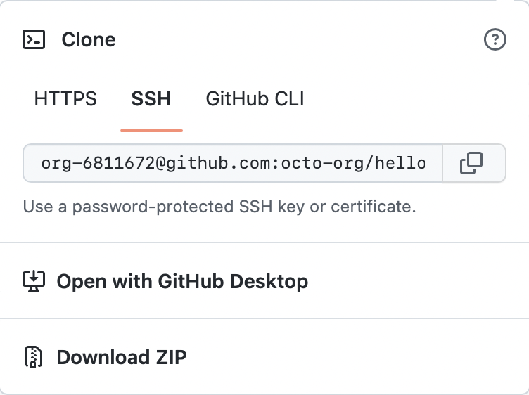

  ```sh
  $ git clone 'PASTE THE URL OF YOUR REPOSITORY HERE'
  ```

3. Move into the newly created directory.

  ```sh
  $ cd your-repo-name-here
  ```
This is what your remote and local repositories look like after this. HEAD is a reference to your current location.</br>
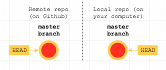

  <!-- ***********************************************************-->
## Step 2 - Raise your issues on the work to be done

Normally, you would decide on which "features" you were going to build and then break these down into smaller issues before starting the work.

For the sake of this exercise, we're just going to [add one issue](https://help.github.com/articles/creating-an-issue/) at the moment. Your client wants a beautifully styled heading for the homepage. It should be simple, bold, black writing with a background shadow that makes it stand out.

1. Raise a new issue with a descriptive title.

2. In the body of the issue, provide more detail about how to complete the work.

3. Assign yourselves to this issue.


<!-- ***********************************************************-->
## Step 3 - Create and move to a new branch

There are many types of workflow. At FAC, we use [the GitHub flow](https://guides.github.com/introduction/flow/), where the `master` [branch](](https://help.github.com/articles/about-branches/)) is always deployable. In this flow, each branch is used for a separate feature.

1. Create a branch with a unique and descriptive name. For example, `create-heading-with-shadow`.

```sh
$ git branch create-heading-with-shadow
```
</br>
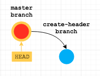
2. Leave the master branch by switching to the new branch you have just created.

```sh
$ git checkout create-heading-with-shadow
```
</br>
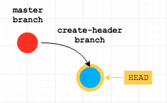

<!-- ***********************************************************-->
## Step 4 - Write enough HTML & CSS to satisfy the requirements

1. Add the following code into a file called `index.html`.
    ```html
    <!DOCTYPE html>
    <html lang="en">

    <head>
        <meta charset="UTF-8">
        <meta name="viewport" content="width=device-width, initial-scale=1.0">
        <link rel="stylesheet" href="style.css">
        <title>Git Workflow Workshop</title>
    </head>

    <body>

        <h1 class="some-heading">GIT WORKFLOW WORKSHOW</h1>

    </body>

    </html>
    ```

2. Create a new file called `style.css` which contains:
    ```css
    * {
      margin: 0;
      padding: 0;
    }

    .page-heading {
      box-sizing: border-box;
      font-family: "Avant Garde", Avantgarde, "Century Gothic", CenturyGothic, "AppleGothic", sans-serif;
      font-size: 3.5rem;
      padding: 5rem 3rem;
      text-align: center;
      text-rendering: optimizeLegibility;
      color: #131313;
      background-color: #e7e5e4;
      letter-spacing: .15em;
      text-shadow: 1px -1px 0 #767676, -1px 2px 1px #737272, -2px 4px 1px #767474, -3px 6px 1px #787777, -4px 8px 1px #7b7a7a, -5px 10px 1px #7f7d7d, -6px 12px 1px #828181, -7px 14px 1px #868585, -8px 16px 1px #8b8a89, -9px 18px 1px #8f8e8d, -10px 20px 1px #949392, -11px 22px 1px #999897, -12px 24px 1px #9e9c9c, -13px 26px 1px #a3a1a1, -14px 28px 1px #a8a6a6, -15px 30px 1px #adabab, -16px 32px 1px #b2b1b0, -17px 34px 1px #b7b6b5, -18px 36px 1px #bcbbba, -19px 38px 1px #c1bfbf, -20px 40px 1px #c6c4c4, -21px 42px 1px #cbc9c8, -22px 44px 1px #cfcdcd, -23px 46px 1px #d4d2d1, -24px 48px 1px #d8d6d5, -25px 50px 1px #dbdad9, -26px 52px 1px #dfdddc, -27px 54px 1px #e2e0df, -28px 56px 1px #e4e3e2;
    }
    ```


<!-- ***********************************************************-->
## Step 5 - Add the new files to the staging area

1. Add `index.html` and `style.css` to the [staging area](http://softwareengineering.stackexchange.com/questions/119782/what-does-stage-mean-in-git).

  ```sh
  $ git add index.html style.css
  ```
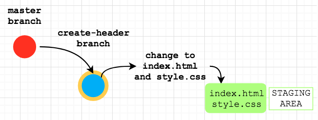

<!-- ***********************************************************-->
## Step 6 - Commit your changes

The history of a project is made up of ["commits"](https://stackoverflow.com/questions/2745076/what-are-the-differences-between-git-commit-and-git-push). Each commit is a snapshot of your whole repository at one particular time.

1. Commit the files that are in the staging area.

  Before closing the commit message with a quote symbol you can press enter on your keyboard to continue typing in the new terminal line. The text in the second line can be used as an additional message.

  It is a good practice to link your commit to an existing issue by typing  `Relates #1`. Thanks to using the hash symbol followed by the relevant issue number your commit will be [automatically linked to an existing issue](https://help.github.com/articles/autolinked-references-and-urls/).

  ```sh
  $ git commit -m 'add git workshop heading & shadow styling
  > Relates #1'
  ```
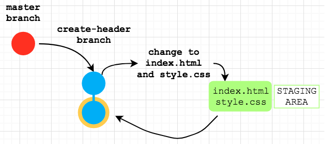

<!-- ***********************************************************-->
## Step 7 - Push your local version up to GitHub

At this point, your remote repo looks exactly the same as at the beginning. You need to push your changes.

1. [Push](https://help.github.com/articles/pushing-to-a-remote/) the `create-heading-with-shadow` branch up to the "origin" i.e. the GitHub repo that you cloned from.

  ```sh
  $ git push origin create-heading-with-shadow
  ```

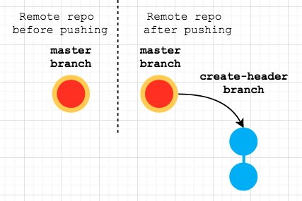

<!-- ***********************************************************-->
## Step 8 - Create a pull request

1. Programmer 1 navigates to the repository on GitHub.com and creates a [pull request](https://help.github.com/articles/creating-a-pull-request/#creating-the-pull-request).

    + Add a descriptive title (e.g. `Create page heading`) and leave a comment linking the pull request to the issue.

    + Select Programmer 2 as an [assignee](https://help.github.com/articles/assigning-issues-and-pull-requests-to-other-github-users/).

    


<!-- ***********************************************************-->
## Step 9 - Programmer 2 merges the pull request :+1:
You should never merge your own pull requests. A PR gives the rest of your team the chance to review before your changes are merged into `master`. In your projects, you will be asking the other pair to do this.

1. Programmer 2 reviews the changes and [merges the pull request](https://help.github.com/articles/merging-a-pull-request/#merging-a-pull-request-on-github) on GitHub.com.

  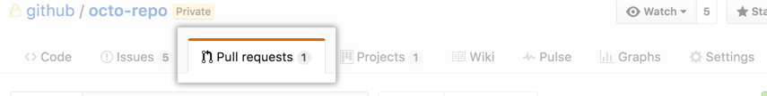    

Now your remote repo looks like this: </br>
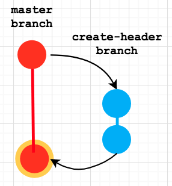


<!-- ***********************************************************-->
# Splitting the work
Your client has just called you and asked to improve heading on their [company website](https://piotrberebecki.github.io/git-workflow-workshop-for-two/).

There are two issues that when resolved will make the heading look really nice:

1. Spelling mistake in the heading (the word 'WORKSHOW' should be replaced with 'WORKSHOP')
1. The name of the css class in the heading needs to be updated so that existing styles in the `style.css` file can take effect (`class="some-heading"` should be replaced with `class="page-heading"`).

Current heading:


When you apply the two changes above the heading will look like this:


You decide that one of you **(Programmer 1) will resolve issue number 1** while the other person **(Programmer 2) will resolve issue number 2**. When you begin working on your weekly projects, you will always be pairing. So programmer 1 represents "pair 1" and programmer 2 represents "pair 2".

**Note: Only one line in the `index.html` file needs to be modified.**


<!-- ***********************************************************-->
## Step 1 - Programmer 2 clones the repo

1. Make sure both teammates have a cloned, so you each have a local version on your own computer

    ```sh
    $ git clone 'PASTE THE URL OF YOUR REPOSITORY HERE'
    ```


<!-- ***********************************************************-->
## Step 2 - Raise these 2 new issues

1. Create the following two issues and assign each one to a different person

    + `Fix spelling typo in <h1> heading` (Programmer 1)

    + `Correct the class name of <h1> heading to match the existing class name in the css file` (Programmer 2)


<!-- ***********************************************************-->
## Step 3 - Both programmers create one branch each and switch to them

1. Both programmers create one branch each: `fix-typo-heading` (Programmer 1) and `update-class-heading` (Programmer 2).

  ```sh
  # Programmer 1:
  $ git branch fix-typo-heading

  # Programmer 2:
  $ git branch update-class-heading
  ```

1. Both programmers leave the master branch by switching to the new branches.

  ```sh
  # Programmer 1:
  $ git checkout fix-typo-heading

  # Programmer 2:
  $ git checkout update-class-heading
  ```

Note: You can achieve both steps _at once_ with `git checkout -b <new-branch-name>`.</br>
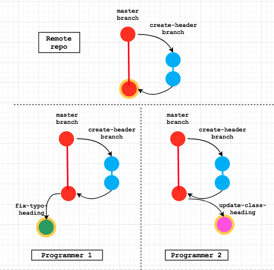

<!-- ***********************************************************-->
## Step 4 - Both programmers open their `index.html` files and make one requested change each

1. **Programmer 1 fixes only the spelling typo** in the heading (WORKSHOW -> WORKSHOP). Please do not update the class name. This is dealt with by Programmer 2.

  ```html
  <h1 class="some-heading">GIT WORKFLOW WORKSHOP</h1>
  ```

1. **Programmer 2 updates only the class name** of the heading (`class="some-heading"` -> `class="page-heading"`). Please do not fix the spelling mistake. This is dealt with by Programmer 1.

  ```html
  <h1 class="page-heading">GIT WORKFLOW WORKSHOW</h1>
  ```


<!-- ***********************************************************-->
## Step 5 - Both programmers save their `index.html` files and check status

1. Both programmers save their `index.html` files.

2. Both programmers check the [status](https://git-scm.com/docs/git-status) of their files, to confirm that `index.html` has been modified.

  ```sh
  $ git status
  ```


<!-- ***********************************************************-->
## Step 6 - Both programmers add the modified `index.html` file to the staging area

1. Both programmers add their modified `index.html` files to the staging area.

  ```sh
  $ git add index.html
  ```


<!-- ***********************************************************-->
## Step 7 - Both programmers commit their changes
1. Both programmers commit the changes. Don't forget the multi-line commit message with the referenced issue.

  ```sh
  # Programmer 1:
  $ git commit -m 'Fix typo in page heading
  > Relates #<issue number>'

  # Programmer 2:
  $ git commit -m 'Update class name in heading
  > Relates #<issue number>'
  ```

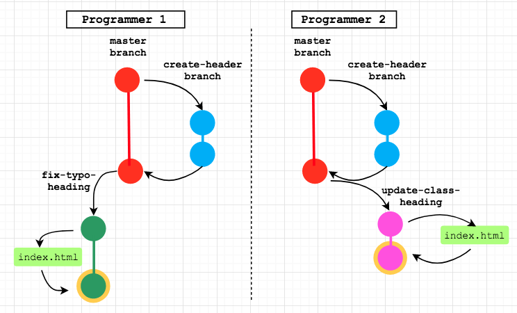

<!-- ***********************************************************-->
## Step 8 - Programmer 1 switches to `master` branch and pulls down the remote `master` branch
We have so many programmers working on this project now, who knows what changes may have happened to the `master` branch since the last time we looked at the remote version that's on GitHub?

1. Programmer 1 switches to `master` branch.

  ```sh
  $ git checkout master
  ```

1. Programmer 1 [pulls](https://git-scm.com/docs/git-pull) the `master` branch from the remote (GitHub repo) to make sure that the local version of `master` is up to date with the remote (GitHub) version of `master`. (There should be no changes since neither of you has pushed any changes to the remote yet.) **It is a good practice to regularly check for changes on the remote before pushing your local changes.**

  ```sh
  $ git pull origin master
  ```

1. Programmer 1 switches back to the `fix-typo-heading` branch.

  ```sh
  $ git checkout fix-typo-heading
  ```


<!-- ***********************************************************-->
## Step 9 - Programmer 1 pushes `fix-typo-heading` branch to remote

1. Programmer 1 [pushes](https://help.github.com/articles/pushing-to-a-remote/) `fix-typo-heading` branch to remote

  ```sh
  $ git push origin fix-typo-heading
  ```

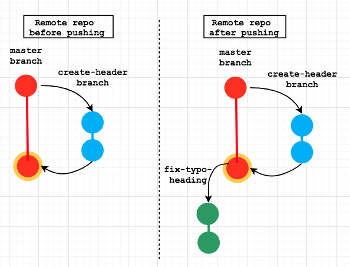

<!-- ***********************************************************-->
## Step 10 - Programmer 1 creates a pull request

1. Programmer 1 navigates to the repository on GitHub.com and creates a [pull request](https://help.github.com/articles/creating-a-pull-request/#creating-the-pull-request).

    + Add a descriptive title (e.g. `Fix the spelling mistake in page heading`) and leave a comment linking the pull request to the issue.

    + Select Programmer 2 as an [assignee](https://help.github.com/articles/assigning-issues-and-pull-requests-to-other-github-users/).

    


<!-- ***********************************************************-->
## Step 11 - Programmer 2 reviews the pull request

Programmer 2 [reviews the pull request](https://help.github.com/articles/about-pull-request-reviews/)

1. Step through each commit (in this case one)

2. Check the "Files changed" tab for a line-by-line breakdown.

2. Click "Review changes" and choose:
    + "Comment"
    + "Approve"
    + "Request changes"


<!-- ***********************************************************-->
## Step 12 - Programmer 2 merges the pull request :+1:

1. Programmer 2 [merges the pull request](https://help.github.com/articles/merging-a-pull-request/#merging-a-pull-request-on-github) on GitHub.com.

  

2. Programmer 2 opens the live website on GitHub pages to double check that the spelling mistake has been corrected. Go to the repository settings on Github and scroll down until you find Github Pages title. Select the master branch as the source and save, and you'll then see the URL where the live website is. 

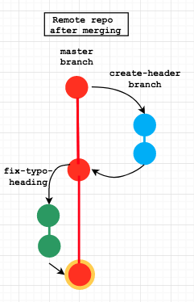


<!-- ***********************************************************-->
## Step 13 - Programmer 2 switches to `master` branch, pulls the remote `master` branch, tries to merge it into `update-class-heading` branch and :collision: resolves merge conflicts :collision:

1. Programmer 2 switches to `master` branch.

  ```sh
  $ git checkout master
  ```

2. Programmer 2 [pulls](https://git-scm.com/docs/git-pull) the remote `master` branch to make sure that the latest version of the project is available locally.

  ```sh
  $ git pull origin master
  ```

  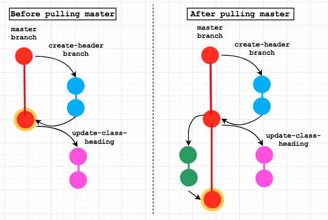

3. Programmer 2 switches back to the `update-class-heading` branch.

  ```sh
  $ git checkout update-class-heading
  ```

4. Programmer 2 tries to merge `master` branch into `update-class-heading` branch.

  ```sh
  $ git merge master
  ```

5. There should be a :collision: merge conflict :collision: since the line with the `<h1>` heading is different. [Merge conflict should be highlighted with HEAD and master markers](http://stackoverflow.com/questions/7901864/git-conflict-markers) as follows:

  ```html
  <body>

  <<<<<<< HEAD
      <h1 class="page-heading">GIT WORKFLOW WORKSHOW</h1>
  =======
      <h1 class="some-heading">GIT WORKFLOW WORKSHOP</h1>
  >>>>>>> master

  </body>
  ```

6. Programmer 2 removes HEAD and master markers and leaves only one line with `<h1>` heading so that both issues are addressed.

  ```html
  <body>

      <h1 class="page-heading">GIT WORKFLOW WORKSHOP</h1>

  </body>
  ```

7. Programmer 2 adds the `index.html` file to staging area and commits the changes occurred during the merge conflict.

  ```sh
  # First add to staging area
  $ git add index.html

  # Then commit changes
  $ git commit -m 'Fix merge conflict
  > Relates #<issue number> and #<issue number>'
  ```

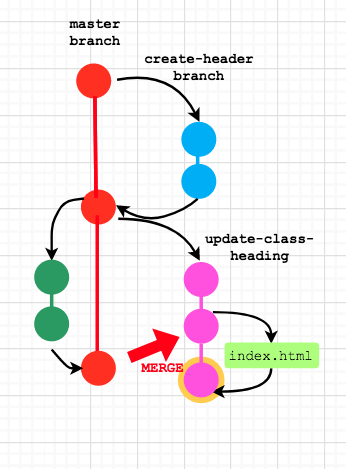

<!-- ***********************************************************-->
## Step 14 - Programmer 2 pushes `update-class-heading` branch to remote

1. Programmer 2 [pushes](https://help.github.com/articles/pushing-to-a-remote/) `update-class-heading` branch to remote.

  ```sh
    $ git push origin update-class-heading
  ```

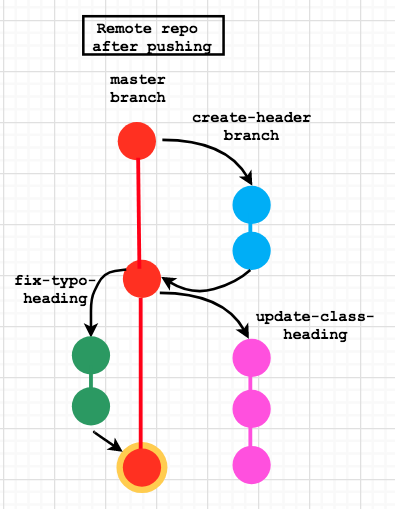


<!-- ***********************************************************-->
## Step 15 - Programmer 2 creates a pull request

1. Programmer 2 navigates to the repository on GitHub.com and creates a [pull request](https://help.github.com/articles/creating-a-pull-request/#creating-the-pull-request) selecting `master` as a base branch and `update-class-heading` as a head branch. Please add a descriptive title (e.g. `Update class name in page heading`) and leave a comment linking the pull request with the issue `#<number>`. Please also select Programmer 1 as an [assignee](https://help.github.com/articles/assigning-issues-and-pull-requests-to-other-github-users/).


<!-- ***********************************************************-->
## Step 16 - Programmer 1 merges the pull request :+1:

1. Programmer 1 reviews and [merges the pull request](https://help.github.com/articles/merging-a-pull-request/#merging-a-pull-request-on-github) on GitHub.com.

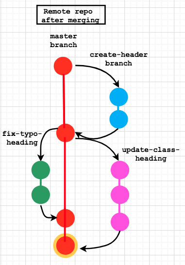

2. Programmer 1 opens the live website on GitHub pages to double check the new heading style.

  


<!-- ***********************************************************-->
## That's it 😄 Thank you for checking out the 'Git Workflow Workshop for Two Programmers' :clap:  

***A summary of the above commands and what they do can be found [here](/images/git-flow-summary-table.png) in a neat little table.***


**Note**: This workshop does not introduce the very popular idea of forking a repository, which is very useful when wanting to contribute to existing open source projects 💯. Forking is not required when starting a new repository under `foundersandcoders` or `FAC-X` organisations since all your fellow students will be automatically added as contributors. 

Having said that, we recommend you read about forking to be able to contribute to open source projects. You can read more about it [here](https://help.github.com/en/articles/fork-a-repo). 
