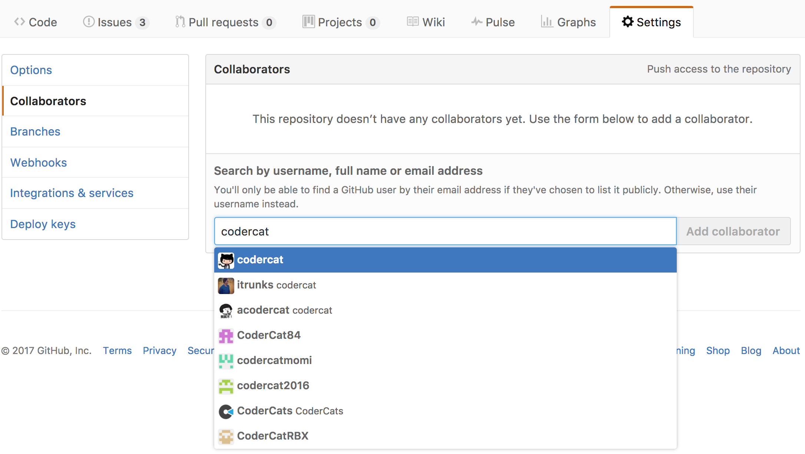
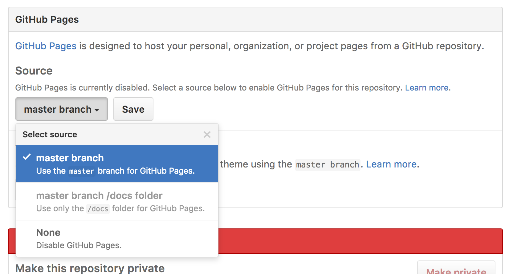
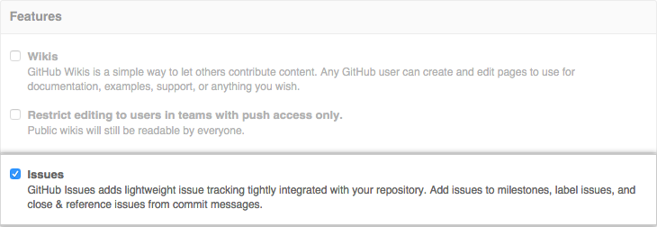

# Git workflow workshop for two programmers


<!-- ***********************************************************-->
## Workshop summary

An exercise to practice git workflow skills. The workshop should be undertaken by two programmers, working on two computers. The skills practiced include:

- cloning a repository
- creating branches
- switching branches
- adding changes to staging area
- committing changes
- pulling latest version from the remote master branch
- merging master branch into recently created branch
- resolving merge conflicts
- pushing to remote repository
- creating a pull request on Github
- merging a pull request on GitHub


<!-- ***********************************************************-->
## OK, let's start :rocket:

Your client has just called you and asked to improve heading on their [company website](https://piotrberebecki.github.io/git-workflow-workshop-for-two/).

There are two issues in that when resolved will make the heading look really nice:

1. Spelling mistake in the heading (the word 'WORKSHOW' should be replaced with 'WORKSHOP')
1. The name of the css class in the heading needs to be updated so that existing styles in the `style.css` file can take effect (`class="some-heading"` should be replaced with `class="page-heading"`).

Current heading:


When you apply the two changes above the heading will look like this:


You decide that one of you **(Programmer 1) will resolve issue number 1** while the other person **(Programmer 2) will resolve issue number 2**.

**Note: Only one line in the `index.html` file needs to be modified.**


<!-- ***********************************************************-->
## Step 1 - Programmer 1 forks this repository and adds Programmer 2 as a collaborator

1. Programmer 1 [forks](https://help.github.com/articles/fork-a-repo/) this repository.

  

2. Programmer 1 goes into settings of the newly forked repository and adds Programmer 2 as a [collaborator](https://help.github.com/articles/inviting-collaborators-to-a-personal-repository/).

  

3. Programmer 2 accepts the invitation to the new repository via their email.


<!-- ***********************************************************-->
## Step 2 - Programmer 2 enables GitHub pages and reports 2 issues

1. Programmer 2 goes into repository settings and enables [GitHub pages](https://help.github.com/articles/configuring-a-publishing-source-for-github-pages/).

  

2. Programmer 2 goes into repository settings and makes sure that the [issues](https://guides.github.com/features/issues/) feature is enabled. This will enable you to see your changes on live website.

  

3. Programmer 2 creates the following two [issues](https://help.github.com/articles/creating-an-issue/):

  `Fix spelling typo in <h1> heading`

  `Correct the class name of <h1> heading to match the existing class name in the css file`


<!-- ***********************************************************-->
## Step 3 - Both programmers clone the forked repository

1. Both programmers [clone](https://help.github.com/articles/cloning-a-repository/) the forked repository using their terminal.

  

  ```sh
  $ git clone 'PASTE THE URL OF YOUR REPOSITORY HERE'
  ```

2. Both programmers navigate to the newly created directory.

  ```sh
  $ cd git-workflow-workshop-for-two
  ```


<!-- ***********************************************************-->
## Step 4 - Both programmers create one branch each

1. Both programmers create one [branch](https://help.github.com/articles/about-branches/) each. Unique and descriptive branch names work best, for example, `fix-typo-heading` (Programmer 1) and `update-class-heading` (Programmer 2).

  ```sh
  # Programmer 1:
  $ git branch fix-typo-heading

  # Programmer 2:
  $ git branch update-class-heading
  ```


<!-- ***********************************************************-->
## Step 5 - Both programmers open their `index.html` files and make one requested change each

1. Programmer 1 fixes only the spelling typo in the heading (Workshow -> Workshop).

  ```html
  <h1 class="some-heading">GIT WORKFLOW WORKSHOP</h1>
  ```

1. Programmer 2 updates only the class name of the heading (`nice-heading` -> `page-heading`).

  ```html
  <h1 class="page-heading">GIT WORKFLOW WORKSHOW</h1>
  ```


<!-- ***********************************************************-->
## Step 6 - Both programmers save their `index.html` files and check status

1. Both programmers save their `index.html` files and check the [status](https://git-scm.com/docs/git-status) to confirm that the file has been modified.

  ```sh
  $ git status
  ```


<!-- ***********************************************************-->
## Step 7 - Both programmers add the modified `index.html` file to the staging area

1. Both programmers add their modified `index.html` files to the [staging area](http://softwareengineering.stackexchange.com/questions/119782/what-does-stage-mean-in-git).

  ```sh
  $ git add index.html
  ```


<!-- ***********************************************************-->
## Step 8 - Both programmers commit their changes.

1. Both programmers [commit](http://stackoverflow.com/questions/27˜Ω45076/what-are-the-differences-between-git-commit-and-git-push) the changes. Before closing the commit message with a quote symbol you can press enter on your keyboard to continue typing in the new terminal line. The text in the second line can be used as an additional message. It is a good practice to link your commit to an existing issue by typing  `Relates #1`. Thanks to using the hash symbol followed by the relevant issue number your commit will be [automatically linked to an existing issue](https://help.github.com/articles/autolinked-references-and-urls/).

  ```sh
  # Programmer 1:
  $ git commit -m 'Fix typo in page heading
  > Relates #1'

  # Programmer 2:
  $ git commit -m 'Update class name in heading
  > Relates #2'
  ```


<!-- ***********************************************************-->
## Step 9 - Programmer 1 switches to `master` branch and pulls remote `master` branch

1. Programmer 1 switches to `master` branch.

  ```sh
  $ git checkout master
  ```

1. Programmer 1 [pulls](https://git-scm.com/docs/git-pull) the remote `master` branch to make sure that the latest version of the project is available locally. There should be no changes since none of you have pushed any changes to the remote yet. It is a good practice to regularly check for changes on the remote before pushing your local changes.

  ```sh
  $ git pull origin master
  ```

1. Programmer 1 switches back to the `fix-typo-heading` branch.

  ```sh
  $ git checkout fix-typo-heading
  ```


<!-- ***********************************************************-->
## Step 10 - Programmer 1 pushes `fix-typo-heading` branch to remote

1. Programmer 1 [pushes](https://help.github.com/articles/pushing-to-a-remote/) `fix-typo-heading` branch to remote

  ```sh
  $ git push origin fix-typo-heading
  ```


<!-- ***********************************************************-->
## Step 11 - Programmer 1 creates a pull request

1. Programmer 1 navigates to the repository on GitHub.com and creates a [pull request](https://help.github.com/articles/creating-a-pull-request/#creating-the-pull-request) selecting `master` as a base branch and `fix-typo-heading` as a head branch. Please add a descriptive title (e.g. `Fix the spelling mistake in page heading`) and leave a comment linking the pull request with the issue `#1`. Please also select Programmer 2 as an [assignee](https://help.github.com/articles/assigning-issues-and-pull-requests-to-other-github-users/).

  


<!-- ***********************************************************-->
## Step 12 - Programmer 2 merges the pull request :+1:

1. Programmer 2 reviews and [merges the pull request](https://help.github.com/articles/merging-a-pull-request/#merging-a-pull-request-on-github) on GitHub.com.

  

2. Programmer 2 opens the live website on GitHub pages to double check that the spelling mistake has been corrected. The URL typically has the following format: https://ENTER-YOUR-USERNAME-HERE.github.io/git-workflow-workshop-for-two/


<!-- ***********************************************************-->
## Step 13 - Programmer 2 switches to `master` branch, pulls the remote `master` branch, tries to merge it into `update-class-heading` branch and :collision: resolves merge conflicts :collision:

1. Programmer 2 switches to `master` branch.

  ```sh
  $ git checkout master
  ```

1. Programmer 2 [pulls](https://git-scm.com/docs/git-pull) the remote `master` branch to make sure that the latest version of the project is available locally.

  ```sh
  $ git pull origin master
  ```

1. Programmer 2 switches back to the `update-class-heading` branch.

  ```sh
  $ git checkout update-class-heading
  ```

1. Programmer 2 tries to merge `master` branch into `update-class-heading` branch.

  ```sh
  $ git merge master
  ```

1. There should be a merge conflict since the line with the `<h1>` heading is different. [Merge conflict should be highlighted with HEAD and master markers](http://stackoverflow.com/questions/7901864/git-conflict-markers) as follows:

  ```html
  <!DOCTYPE html>
  <html lang="en">

  <head>
      <meta charset="UTF-8">
      <meta name="viewport" content="width=device-width, initial-scale=1.0">
      <link rel="stylesheet" href="style.css">
      <title>Document</title>
  </head>

  <body>

  <<<<<<< HEAD
      <h1 class="page-heading">GIT WORKFLOW WORKSHOW</h1>
  =======
      <h1 class="some-heading">GIT WORKFLOW WORKSHOP</h1>
  >>>>>>> master

  </body>

  </html>
  ```

1. Programmer 1 saves the following version of the `index.html` file so that both issues are addressed.

  ```html
  <!DOCTYPE html>
  <html lang="en">

  <head>
      <meta charset="UTF-8">
      <meta name="viewport" content="width=device-width, initial-scale=1.0">
      <link rel="stylesheet" href="style.css">
      <title>Document</title>
  </head>

  <body>

      <h1 class="page-heading">GIT WORKFLOW WORKSHOP</h1>

  </body>

  </html>
  ```

  1. Programmer 1 adds the `index.html` file to staging area and commits the changes occurred during the merge conflict.

    ```sh
    # First add to staging area
    $ git add index.html

    # Then commit changes
    $ git commit -m 'Fix merge conflict
    > Relates #1 and #2'
    ```


<!-- ***********************************************************-->
## Step 15 - Programmer 2 pushes `update-class-heading` branch to remote

1. Programmer 2 [pushes](https://help.github.com/articles/pushing-to-a-remote/) `update-class-heading` branch to remote.

  ```sh
    $ git push origin update-class-heading
  ```


<!-- ***********************************************************-->
## Step 16 - Programmer 2 creates a pull request

1. Programmer 2 navigates to the repository on GitHub.com and creates a [pull request](https://help.github.com/articles/creating-a-pull-request/#creating-the-pull-request) selecting `master` as a base branch and `update-class-heading` as a head branch. Please add a descriptive title (e.g. `Update class name in page heading`) and leave a comment linking the pull request with the issue `#2`. Please also select Programmer 1 as an [assignee](https://help.github.com/articles/assigning-issues-and-pull-requests-to-other-github-users/).


<!-- ***********************************************************-->
## Step 17 - Programmer 1 merges the pull request :+1:

1. Programmer 1 reviews and [merges the pull request](https://help.github.com/articles/merging-a-pull-request/#merging-a-pull-request-on-github) on GitHub.com.

2. Programmer 1 opens the live website on GitHub pages to double check the new heading style.

  
